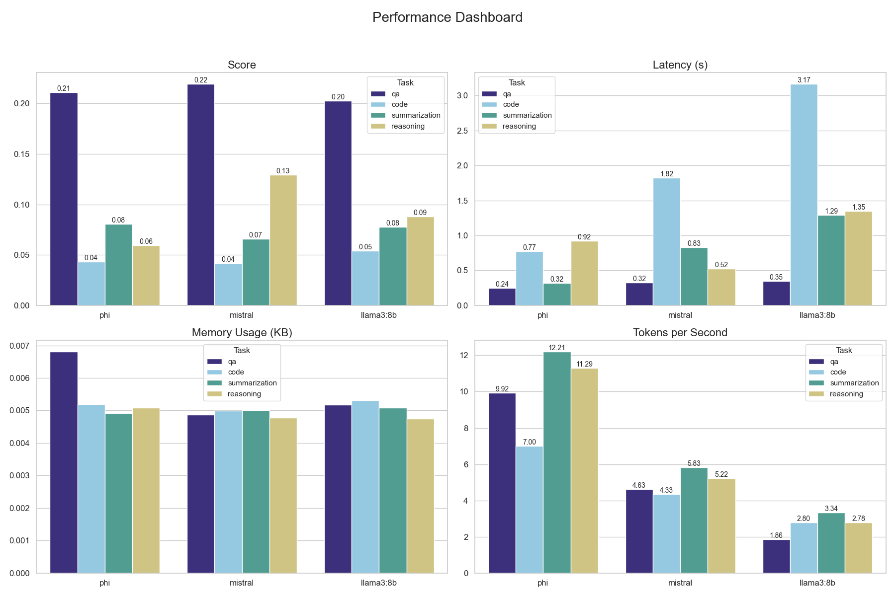
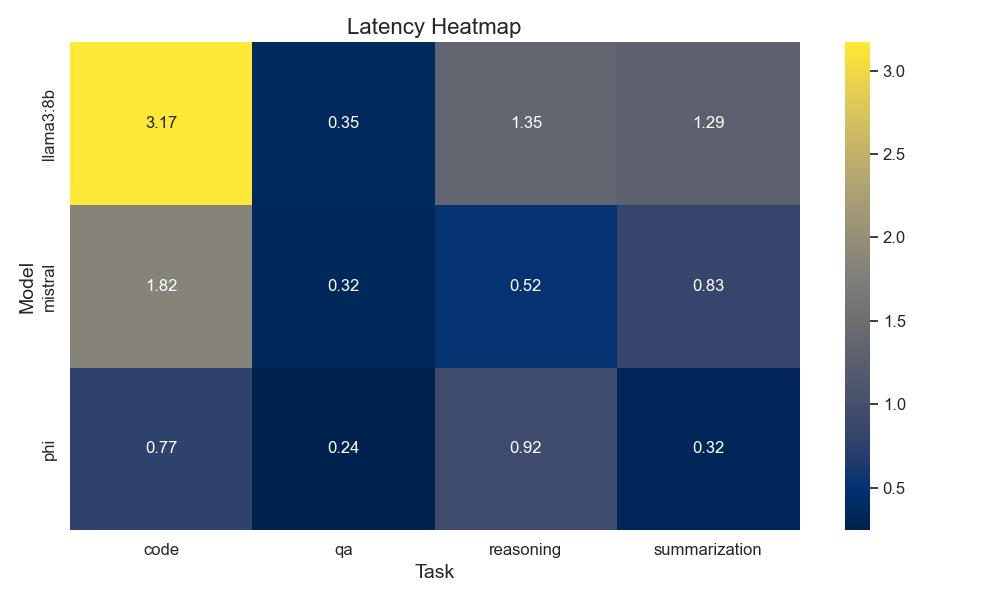
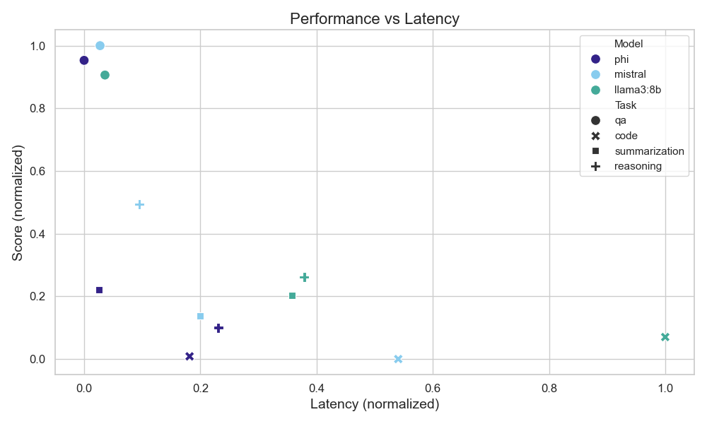
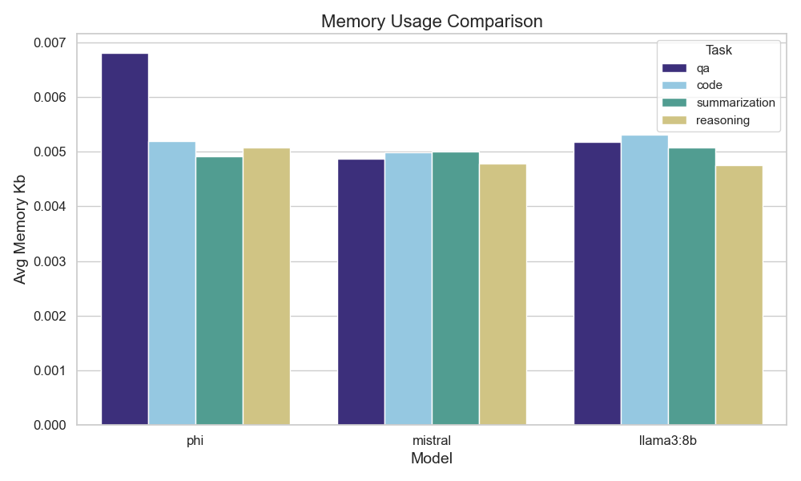

# LLM Benchmarking Results
This report analyzes the performance, latency, and memory usage of different models (Llama3:8b, Mistral, Phi) across various tasks.

## Executive Summary
In terms of overall performance, all three models are not widely differentiated. Users must choose a suitable one for each specific task and practical requirement. Mistral performs the best in QA and reasoning, while Llama3:8b specializes in coding and summarization. Both models offer higher task accuracy at the expense of latency. For contexts that emphasize efficiency, Phi is recommended due to its low latency and high TPS.

## Model Rankings

Llama3:8b and Mistral perform higher task scores, but to obtain a faster response, we recommend Phi.

## Task-specific Performance Analysis



All models perform well in QA while Mistral is specialized in reasoning considering both performance and speed. For coding and summarization, their performances are similar, but Phi specializes in speed.
## Performance vs. Speed Trade-offs

From the scatter plot, there is a roughly reciprocal relationship between score and latency time, meaning that high score is correlated with low latency. However, apart from the three QA results, all the other points reside on the lower part of the graph, with no apparent trade-off. Nevertheless, we can still conclude that Phi delivers acceptable scores with low latency from the discovery that it dominates the left area.

## Resource Usage Analysis

All these three models are optimized so that their memory usage across tasks is around 0.05KB. On average, Mistral makes the lowest memory consumption. There is an outlier that Phi's average memory usage excels at nearly 0.07KB for QA tasks, probably due to Phi's high speed in generation.

## Example Responses
### Good Response
```**Prompt**: Question: What is the capital of France?
Answer: 
**Response**: The answer is Paris!
```
### Bad Response
```**Prompt**: If it rains, the ground gets wet. The ground is wet. 

Question: Did it necessarily rain?

Answer:  
**Response**: A classic example of a logical fallacy!

The correct answer is:

No, it did not necessarily rain.

Just because the ground is wet does not mean that it rained. There are many other possible explanations for why the ground might be wet, such as flooding, irrigation, or even human error (e.g., someone poured water on the ground!).
```
## Conclusions and Recommendations
No single model can universally outperform others in all tasks. Instead, the choice of the model should be based on task-specific requirements and performance priorities, such as memory and speed.

